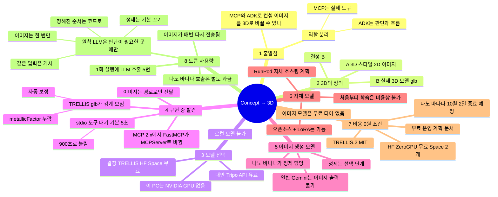
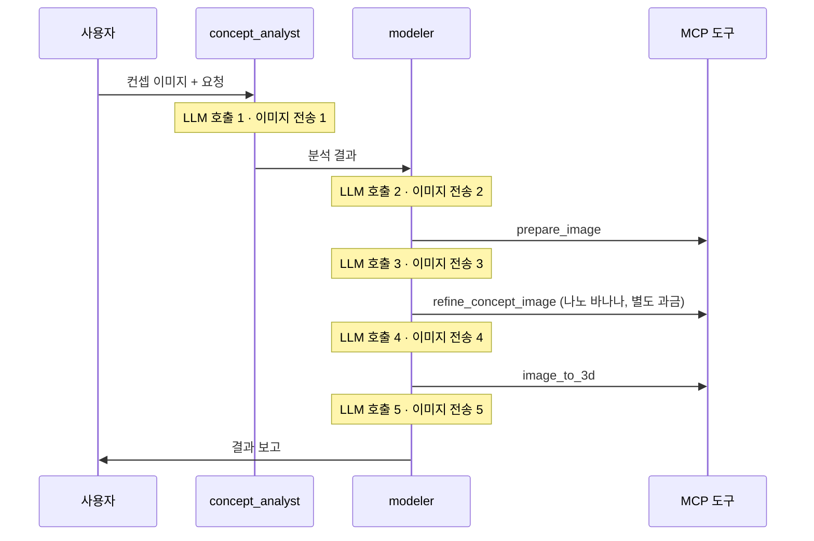
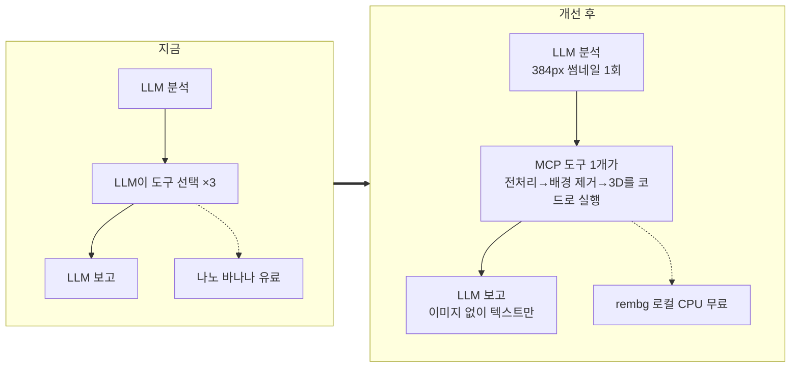

# Concept → 3D

컨셉 이미지를 올리면 **ADK 에이전트**가 분석하고, **MCP 서버**의 도구로 3D 모델(`.glb`)을 만들어 주는 파이썬 프로젝트입니다.

```
사용자 이미지
   │
   ▼
┌──────────── ADK: SequentialAgent "concept3d" ────────────┐
│ before_agent_callback  첨부 이미지를 workspace/inputs에 저장 │
│ 1. concept_analyst     피사체/형태/색/유지할 특징 분석        │
│                        + 정제용 영어 프롬프트 (output_key)    │
│ 2. modeler             MCP 도구를 순서대로 호출하고 결과 보고  │
└──────────────────────────────┬───────────────────────────┘
                               │ McpToolset (stdio)
┌──────────── MCP 서버: mcp_server/server.py ───────────────┐
│ prepare_image         회전 보정, 흰 배경 정사각형 패딩        │
│ refine_concept_image  Gemini 이미지 모델로 3D 변환용 재드로잉  │
│ image_to_3d           trellis(무료 HF Space) | tripo(유료 API) │
│ list_outputs          생성된 .glb 목록                        │
└──────────────────────────────────────────────────────────┘
```

## 설치

```bash
uv sync
```

`.env.example`을 `.env`로 복사하고 `GOOGLE_API_KEY`를 넣습니다. 필수 값은 이것 하나입니다.

## 실행

**Streamlit UI** (이미지 업로드 → 3D 뷰어 → .glb 다운로드)

```bash
uv run streamlit run app.py
```

**ADK 개발 UI** (에이전트 이벤트, 도구 호출, state를 단계별로 확인)

```bash
uv run adk web agents
```

## 파일 구조

| 경로 | 역할 |
|---|---|
| `mcp_server/server.py` | MCP 서버. 이미지 처리와 3D 변환 도구 |
| `agents/concept3d/agent.py` | ADK 에이전트 (`root_agent`) |
| `app.py` | Streamlit 화면 |
| `workspace/` | 입력, 정제 이미지, 생성된 모델 저장 (git 제외) |

## 설계 메모

- **이미지는 파일 경로로만 주고받습니다.** base64를 LLM 컨텍스트에 넣지 않으려고 콜백에서 첨부 이미지를 파일로 저장하고, 도구끼리는 경로를 넘깁니다.
- **stdio MCP의 `timeout`은 도구 응답 대기 시간이기도 합니다.** ADK 2.10은 stdio 연결의 `timeout`(기본 5초)을 도구 호출 읽기 타임아웃으로도 씁니다. 3D 생성은 수십 초에서 수 분이 걸려서 `timeout=900`으로 설정했습니다.
- **TRELLIS 결과물 재질을 보정합니다.** TRELLIS가 만든 glb에는 `metallicFactor`가 없어서 glTF 기본값 1.0(완전 금속)으로 해석되고, 뷰어에서 거의 검게 보입니다. `image_to_3d`가 저장 후 0으로 채웁니다.
- **백엔드를 바꿔도 에이전트 코드는 그대로입니다.** `image_to_3d`의 `backend` 인자나 `.env`의 `THREED_BACKEND`만 바꾸면 됩니다.

## 알려진 제한

- TRELLIS Space는 무료라서 대기열과 GPU 할당량 제한이 있습니다. 막히면 `HF_TOKEN`을 넣거나 `tripo` 백엔드를 쓰세요.
- `tripo` 백엔드는 공식 API 문서 기준으로 작성했고, 키가 없어서 실제 호출 테스트는 하지 못했습니다.
- 모델 이름(`gemini-2.5-flash`, `gemini-2.5-flash-image`)은 `.env`에서 바꿀 수 있습니다.

---

# 설계 과정: 마인드맵

이 프로젝트를 만들면서 나온 질문, 발견한 사실, 결정을 연결한 지도입니다. 가지 하나가 "질문 → 발견 → 결정" 순서로 읽힙니다.



## 의사결정 기록

| # | 질문·문제 | 발견한 사실 | 결정 | 상태 |
|---|---|---|---|---|
| 1 | MCP와 ADK로 만들 수 있나? | 두 기술은 역할이 겹치지 않음 | ADK는 흐름과 판단, MCP는 도구 | ✅ 구현 |
| 2 | "3D"가 무엇인가? | 3D 스타일 이미지와 실제 3D 모델은 쓰는 모델이 전혀 다름 | 실제 3D 모델(`.glb`) | ✅ 구현 |
| 3 | 어떤 3D 모델을 쓰나? | 이 PC는 Intel 내장 그래픽뿐이라 로컬 추론 불가 | TRELLIS HF Space(무료), Tripo(유료)를 백엔드로 교체 가능하게 | ✅ 구현 (Tripo는 미검증) |
| 4 | 구현 중 문제 | MCP 2.x 이름 변경, stdio 타임아웃 5초, glb가 검게 보임 | `MCPServer` 사용, `timeout=900`, 재질 자동 보정 | ✅ 구현 |
| 5 | 나노 바나나 없이 일반 Gemini로 이미지를 만들 수 있나? | 일반 Gemini는 이미지를 출력하지 못함. TRELLIS는 원본으로도 동작 | 정제는 선택 단계로 취급 | ✅ 확인 |
| 6 | 자체 생성 모델을 만들 수 있나? | 처음부터 학습은 수십만 달러급. 오픈소스 + LoRA는 개인도 가능 | RunPod 자체 호스팅 계획 | 📝 계획 (아래 RunPod 섹션) |
| 7 | 비용 없이 시중 수준이 가능한가? | 나노 바나나 종료 예정, 이미지 모델 무료 티어 없음, 무료 ZeroGPU Space 호스팅 가능 | 품질은 무료로 추격, 처리량은 포기 | 📝 계획 ([free_plan.md](docs/free_plan.md)) |
| 8 | 토큰을 너무 많이 쓰지 않나? | 1회 실행에 LLM 5번 호출, 이미지를 매번 다시 보냄 | 아래 "토큰 사용량 줄이기" | 📝 계획 |

## 토큰 사용량 문제와 해결 과정

### 문제: 기능을 쓰기도 전에 한도가 먼저 닳는다

나노 바나나 호출은 그 자체로 이미지 입출력 토큰이 과금됩니다. 여기에 에이전트의 LLM 호출까지 더해지면, 무료 티어의 요청 수 한도 안에서 기능을 제대로 쓰기 어렵습니다.

### 원인: 지금 코드의 1회 실행 구조



코드에서 확인한 원인은 세 가지입니다.

1. **정해진 순서를 LLM이 매번 결정합니다.** 도구 순서(전처리 → 정제 → 3D)는 항상 같은데, `modeler`가 도구를 하나 부를 때마다 LLM을 한 번씩 호출합니다.
2. **이미지가 매번 다시 전송됩니다.** ADK `LlmAgent`의 기본값 `include_contents='default'`는 대화 기록 전체를 모델에 보냅니다. 그래서 사용자가 올린 이미지가 LLM 호출 5번에 모두 포함됩니다.
3. **이미지 토큰 계산 방식:** Gemini는 가로·세로 모두 384px 이하인 이미지를 258토큰으로 계산하고, 그보다 크면 타일로 나눠 타일당 258토큰을 매깁니다. 1024px 정사각형은 약 4타일, **약 1,032토큰**입니다. 5번 보내면 **이미지만으로 약 5,000토큰**이 듭니다.

### 해결: "LLM은 판단이 필요한 곳에만, 정해진 순서는 코드로"



| 해결책 | 방법 | 기대 효과 |
|---|---|---|
| ① 정해진 순서는 코드로 | MCP 서버에 `concept_to_3d(image_path, refine_mode, seed)` 도구 하나를 추가해 전처리 → 배경 제거 → 3D를 서버 안에서 순서대로 실행. `modeler`는 이 도구 한 번만 호출 | LLM 호출 **5회 → 3회** (분석, 도구 호출, 보고) |
| ② 이미지는 한 번만 | `modeler`에 `include_contents='none'` 설정. 이미지 경로와 분석 결과는 `state`로만 전달 | 이미지 전송 **5회 → 1회** |
| ③ 분석용 이미지 축소 | 분석 에이전트에는 384px 썸네일만 보내고, 3D 변환에는 원본 해상도 사용 | 이미지 1장 **약 1,032 → 258토큰**. 디테일 손실은 테스트 세트로 확인 필요 |
| ④ 정제는 기본 끄기 | `REFINE_BACKEND` 기본값을 `off`로, 배경 정리는 로컬 `rembg`가 담당. 나노 바나나는 사용자가 스타일 변환을 원할 때만 | 나노 바나나 호출 **매번 → 선택할 때만** |
| ⑤ 같은 입력은 캐시 | 입력 이미지 해시와 옵션이 같으면 이전 결과를 바로 반환 | 같은 이미지를 다시 올리면 LLM과 GPU 호출 없음 |

**합치면:** 1회 실행 기준으로 이미지 입력 토큰은 **약 5,000 → 약 260 (약 95% 감소)**, LLM 호출은 **5회 → 3회**, 나노 바나나 호출은 **기본 0회**가 됩니다. 수치는 1024px 입력 기준 추정치이며, 구현 후 실제 사용량으로 다시 측정합니다.

**설계 원칙으로 남길 것:** 에이전트가 "생각"해야 하는 곳(컨셉 분석, 결과 설명, 실패 원인 판단)에만 LLM을 쓰고, 항상 같은 순서로 도는 작업은 MCP 도구 안의 코드로 처리합니다. MCP로 도구를 분리해 둔 덕분에 이 변경은 MCP 서버와 에이전트 설정 몇 줄로 끝납니다.

---

> **무료 운영 계획:** 비용 없이 시중 서비스급 결과를 내는 계획은 [docs/free_plan.md](docs/free_plan.md)에 있습니다.
> ⚠️ 기본 정제 모델 `gemini-2.5-flash-image`는 2026-10-02 종료 예정이라, 그 문서의 0단계를 먼저 진행해야 합니다.

# RunPod 자체 호스팅 전환 계획

> 상태: **계획 단계**입니다. 아래 내용은 아직 구현되지 않았습니다.
> 지금 코드는 외부 서비스(Gemini 나노 바나나, TRELLIS HF Space)에 의존합니다. 목표는 이미지 정제와 3D 변환을 **직접 운영하는 GPU 서버(RunPod)**로 옮기고, 나중에 LoRA로 **우리 스타일 전용 모델**을 얹는 것입니다.

## 1. 목표 구조

```
ADK 에이전트 (변경 없음)
   │ McpToolset (stdio)
   ▼
MCP 서버 (백엔드 선택만 추가)
   ├─ refine_concept_image ── REFINE_BACKEND ─┬─ gemini  : 나노 바나나 API (현재)
   │                                          ├─ runpod  : 자체 정제 워커  ─┐
   │                                          └─ off     : 정제 생략       │
   └─ image_to_3d ─────────── THREED_BACKEND ─┬─ trellis : HF Space (현재)  │
                                              ├─ runpod  : 자체 TRELLIS 워커 ┤
                                              └─ tripo   : 유료 API         │
                                                                           ▼
                                   RunPod Serverless (HTTPS, 초 단위 과금)
                                   ├─ refine 엔드포인트 : SDXL + IP-Adapter + ControlNet (+ LoRA)
                                   └─ trellis 엔드포인트: TRELLIS image-to-3D
                                   RunPod Pod (학습할 때만 켜기)
                                   └─ LoRA 학습 → 가중치를 refine 워커에 적용
```

**ADK 에이전트와 Streamlit 코드는 바꾸지 않습니다.** MCP 서버 안에서 백엔드만 늘리는 구조라서, 처음 설계(도구를 MCP로 분리)가 그대로 유지됩니다.

## 2. 현재 구조와 비교

| 항목 | 현재 코드 | RunPod 자체 호스팅 |
|---|---|---|
| 컨셉 분석 (LLM) | Gemini API | **그대로 Gemini** (LLM까지 직접 올리는 건 이번 범위 밖) |
| 컨셉 정제 | 나노 바나나 API | SDXL + IP-Adapter + ControlNet 워커 |
| 3D 변환 | TRELLIS 공용 HF Space | TRELLIS 전용 워커 |
| 모델 커스터마이징 | 불가 | LoRA로 우리 스타일 학습 가능 |
| 대기열·할당량 | HF Space 공용 대기열, GPU 할당량 제한 | 전용 워커라 제한 없음 (설정한 최대 워커 수까지) |
| 속도 | 대기열에 따라 들쭉날쭉 (테스트 31초) | 워커가 켜져 있으면 일정. **꺼져 있으면 콜드 스타트 1~3분** |
| 비용 | HF 무료 + Gemini 이미지 API 과금 | GPU 사용 시간(초) + 저장소 과금. Pod는 켜 둔 시간만큼 과금 |
| 운영 부담 | 거의 없음 | Docker 이미지, 모델 가중치, 엔드포인트 설정을 직접 관리 |
| 이미지 전송 | Google, HF 공용 Space로 전송 | 내 RunPod 엔드포인트로만 전송 |
| 파일 전달 방식 | 로컬 파일 경로 (HF는 gradio_client가 업로드) | 로컬 경로를 워커가 읽을 수 없음 → **base64로 요청에 담아 전송** |
| 필요한 키 | `GOOGLE_API_KEY` | `GOOGLE_API_KEY`, `RUNPOD_API_KEY`, 엔드포인트 ID 2개 |

### 정제 품질 차이 (솔직한 비교)

| | 나노 바나나 | SDXL + IP-Adapter + ControlNet |
|---|---|---|
| 지시 따르기 ("스카프는 유지하고 배경만 흰색으로") | 강함. 문장으로 편집 가능 | 약함. 프롬프트와 조건 이미지 조합으로 간접 제어 |
| 원본 형태 유지 | 좋음 | ControlNet(canny/depth)으로 형태를 강하게 고정 가능 |
| 원본 특징·스타일 유지 | 좋음 | IP-Adapter 강도로 조절 |
| 우리 스타일 고정 | 불가 | **LoRA로 가능** (자체 호스팅의 핵심 장점) |
| 흰 배경 처리 | 모델이 직접 처리 | 생성 후 `rembg`로 배경 제거를 한 번 더 거치는 편이 안정적 |

즉 자체 호스팅으로 바꾸면 "말로 편집하는 능력"은 조금 내려놓고, 대신 **모델 소유와 스타일 고정**을 얻는 선택입니다. 그래서 `REFINE_BACKEND=gemini`는 비교용으로 계속 남겨 둡니다.

## 3. 현재 코드에서 부족한 점과 해결 방안

| # | 문제 | 원인 (현재 코드) | 해결 방안 |
|---|---|---|---|
| 1 | 정제 백엔드를 바꿀 수 없음 | `refine_concept_image`가 Gemini 호출로 고정 | `REFINE_BACKEND=gemini\|runpod\|off` 분기 추가. `image_to_3d`와 같은 방식으로 맞춤 |
| 2 | 워커가 로컬 파일을 못 읽음 | 도구끼리 로컬 경로만 주고받음 | MCP 서버가 워커를 부르기 직전에만 base64로 변환. **에이전트와 도구 인터페이스는 계속 경로 기반** (LLM 컨텍스트 절약 원칙 유지) |
| 3 | 요청 크기 제한 | RunPod 요청 본문에 크기 제한이 있음 (`/run` 약 10MB, `/runsync` 약 20MB. 공식 문서에서 재확인 필요) | `prepare_image`가 이미 1024px로 줄이므로 PNG 기준 수 MB 이내. 넘으면 JPEG 품질 90으로 재압축 |
| 4 | 긴 작업의 동기 호출 | TRELLIS 호출이 끝날 때까지 블로킹 | `/runsync` 대신 `/run`으로 작업을 걸고 `/status/{job_id}`를 폴링. 기존 `_tripo_generate`의 폴링 구조를 재사용 |
| 5 | 결과 파일 회수 | HF는 gradio_client가 파일을 내려받아 줌 | 워커가 glb를 base64로 반환 (테스트 결과 약 0.8MB라 충분). 파일이 커지면 S3 호환 버킷 업로드 후 URL 반환으로 전환 |
| 6 | 콜드 스타트 | (새로 생기는 문제) | 모델 가중치를 Docker 이미지나 Network Volume에 미리 저장. 발표·데모 전에는 워밍업 요청을 보내거나 잠시 최소 워커를 1로 설정 (그동안은 대기 비용 발생) |
| 7 | 도구 호출 타임아웃 | stdio `timeout=900` | 콜드 스타트와 생성 시간을 합쳐도 충분. 폴링 쪽 최대 대기도 600초로 맞추고, 초과하면 에러 dict 반환 (현재 규칙과 동일) |
| 8 | TRELLIS 설치가 까다로움 | (새로 생기는 문제) CUDA 확장(spconv, nvdiffrast, kaolin 등) 빌드 필요 | Linux + CUDA 베이스 이미지에서 버전을 고정해 빌드. 이 PC는 Windows에 NVIDIA GPU가 없으므로 **RunPod GitHub 연동 빌드**나 Pod 안에서 빌드 |
| 9 | GPU 메모리 | (새로 생기는 문제) SDXL 약 10GB + TRELLIS 약 16GB | 한 GPU에 같이 올리지 않고 **엔드포인트를 2개로 분리** (각각 24GB급 GPU). 따로 확장하고 따로 끌 수 있음 |
| 10 | 재질 보정 | TRELLIS glb에 `metallicFactor` 없음 | 자체 호스팅 TRELLIS도 같은 출력이므로 `_fix_glb_materials`를 모든 백엔드 결과에 그대로 적용 (현재 구조 유지) |
| 11 | 키 관리 | `.env`에 Gemini 키만 있음 | `RUNPOD_API_KEY`, `RUNPOD_REFINE_ENDPOINT`, `RUNPOD_TRELLIS_ENDPOINT` 추가. 키는 `.env`에만 두고 저장소에는 `.env.example`만 올림 |
| 12 | 비용 통제 | (새로 생기는 문제) | 엔드포인트 최대 워커 수 1~2, 유휴 타임아웃을 짧게, RunPod 계정 지출 한도 설정. **학습용 Pod는 작업이 끝나면 반드시 종료** |

## 4. 워커 API 약속

MCP 서버와 워커 사이의 요청·응답 형식을 먼저 정해 두면 워커 구현과 MCP 쪽 구현을 따로 진행할 수 있습니다.

**refine 워커**
```json
// 요청 input
{"image_b64": "...", "prompt": "Keep the red scarf...", "seed": 0,
 "ip_adapter_scale": 0.7, "controlnet": "canny", "controlnet_scale": 0.6, "lora": null}
// 응답 output
{"image_b64": "...", "seconds": 8.2}
```

**trellis 워커**
```json
// 요청 input
{"image_b64": "...", "seed": 0, "mesh_simplify": 0.95, "texture_size": 1024}
// 응답 output
{"glb_b64": "...", "video_b64": "...", "seconds": 24.5}
```

실패하면 두 워커 모두 `{"error": "..."}`를 반환합니다. MCP 도구는 이 에러를 지금처럼 dict로 에이전트에 넘기고, 에이전트가 사용자에게 원인을 설명합니다.

## 5. 단계별 로드맵

| 단계 | 작업 | 바뀌는 파일 | 완료 기준 | 비용 |
|---|---|---|---|---|
| **0. 준비** | `REFINE_BACKEND` 분기와 `off` 모드 추가, `rembg` 배경 제거 옵션, `.env.example`에 RunPod 항목 추가 | `mcp_server/server.py`, `.env.example` | GPU 없이 `off` 모드로 전체 파이프라인 동작 | 없음 |
| **1. TRELLIS 워커** | 핸들러와 Dockerfile 작성 → 빌드 → Serverless 엔드포인트 생성 → MCP에 `runpod` 3D 백엔드 추가 | `runpod_workers/trellis/`, `server.py` | 샘플 머그컵이 HF Space 없이 `.glb`로 생성됨 | 24GB GPU 초 단위 |
| **2. 정제 워커** | SDXL + IP-Adapter + ControlNet 핸들러 → 엔드포인트 → MCP에 `runpod` 정제 백엔드 추가 | `runpod_workers/refine/`, `server.py` | 나노 바나나 없이 정제 → 3D까지 동작. 같은 입력으로 두 방식 결과 비교 | 24GB GPU 초 단위 |
| **3. LoRA 학습** | 스타일 이미지 20~100장 준비 → Pod에서 학습 → 가중치를 Network Volume에 저장 → refine 워커가 `lora` 인자로 로드 | `training/`, `runpod_workers/refine/` | LoRA를 켜고 끈 결과의 스타일 차이가 눈에 보임 | 학습 1~3시간분 Pod 비용 |
| **4. 운영 정리** | 워밍업 도구(`warmup_backends`), 비용 한도, 백엔드별 실패 시 자동 대체(runpod 실패 → trellis Space) | `server.py`, README | 콜드 스타트 상태에서도 데모가 끊기지 않음 | 없음 |

**1단계를 2단계보다 먼저 하는 이유:** 공용 Space의 할당량 문제가 가장 먼저 부딪히는 한계이고, TRELLIS는 이미 검증된 입출력이 있어서 결과를 바로 비교할 수 있습니다.

### 예정된 파일 구조

```
concept3d_agent/
├─ mcp_server/server.py        # 백엔드 분기 추가 (gemini|runpod|off, trellis|runpod|tripo)
├─ runpod_workers/
│  ├─ trellis/  handler.py, Dockerfile, requirements.txt
│  └─ refine/   handler.py, Dockerfile, requirements.txt
└─ training/    LoRA 학습 스크립트와 설정
```

### 사용할 모델과 라이선스

| 모델 | 용도 | 라이선스 (사용 전 원문 확인) |
|---|---|---|
| TRELLIS | 이미지 → 3D | MIT |
| SDXL base 1.0 | 정제용 베이스 | CreativeML Open RAIL++-M |
| IP-Adapter (SDXL) | 원본 특징 유지 | Apache 2.0 |
| ControlNet (SDXL canny/depth) | 원본 형태 유지 | 모델마다 다름 |
| FLUX.1-schnell (대안 베이스) | 품질이 더 필요할 때 | Apache 2.0 (FLUX.1-dev는 비상업용이라 제외) |

## 6. 사용자가 직접 해야 하는 일

- RunPod 크레딧 충전과 지출 한도 설정
- `.env`에 `RUNPOD_API_KEY` 직접 입력 (채팅이나 코드에 붙여넣지 않기)
- 3단계를 할 경우 학습용 스타일 이미지 준비
- 과금 리소스(엔드포인트, Pod)를 만들기 전에 GPU 종류와 예상 비용 확인

---

## 확장 아이디어

- **Critic 루프:** `LoopAgent`로 정제 이미지가 원본 컨셉의 특징을 지켰는지 검사하고 재생성하기
- **멀티뷰 입력:** TRELLIS의 `multiimages`로 정면, 측면 등 여러 장을 넣어 형태 정확도 높이기
- **MCP 서버 재사용:** 같은 서버를 Claude Desktop 같은 다른 MCP 클라이언트에 연결하기
- **LLM까지 자체 호스팅:** 컨셉 분석을 오픈소스 비전 LLM으로 바꾸면 외부 API 의존이 완전히 사라짐 (RunPod 전환 이후 과제)
